<!-- BLUE MATRIX HEADER — upload blue_matrix_header.svg to your profile repo root -->

  

  

---

# 👨‍💻 About Me

🚀 Passionate about building **AI powered systems and scalable applications**

- 🎓 Final Year **B.Tech Computer Science (AI/ML)**
- 🤖 Interested in **Artificial Intelligence**
- ⚙️ Love building **Full Stack Platforms**
- 🌐 Exploring **Cloud Infrastructure**
- 🚀 Working on **AI powered productivity tools**

---

<!-- floating avatar -->

## ⚡ Tech Stack

  

## 📊 GitHub Stats

  
  

  

<!-- floating avatar -->

## 📈 Contribution Graph

  

---

## 🏆 Achievements

| 🎖️ Badge | 🏅 Achievement | 📅 Year |
|:---------:|:--------------|:-------:|
| 🤖 | Built AI-powered productivity tool from scratch | 2024 |
| 🌐 | Developed full-stack video conferencing platform — Nex | 2024 |
| 📖 | Created AI Storytelling Generator — Granny Tales | 2024 |
| ☁️ | Deployed production apps on AWS & Vercel | 2024 |
| 🎓 | Pursuing B.Tech in CS with AI/ML specialization | 2023–25 |

---

# 🌟 Featured Projects

| Project | Description | Tech |
|---------|-------------|------|
| **InsightAI** | AI powered task intelligence engine | Next.js, AI |
| **Nex** | Video conferencing platform | Next.js |
| **Granny Tales** | AI storytelling generator | Python |

---

# 🌐 Connect With Me

  
  

---

# 🐍 Contribution Snake

  

---

# 👀 Profile Views

  

---

<!-- BLUE MATRIX FOOTER -->

  

  

